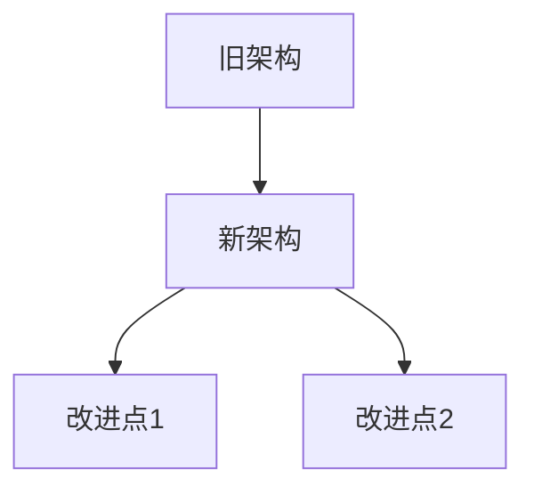

# WkKit Wiki 更新文档

## 📅 更新日期
YYYY-MM-DD

## 🎯 今日更新目标
- [ ] 目标1
- [ ] 目标2
- [ ] 目标3

## ✅ 已完成工作

### 1. 代码更新
**文件修改**:
- `文件路径1`: 修改说明
- `文件路径2`: 修改说明
- `文件路径3`: 修改说明

**新增文件**:
- `文件路径1`: 功能说明
- `文件路径2`: 功能说明

### 2. 功能实现
**新功能**:
- 功能1: 详细说明
- 功能2: 详细说明

**功能改进**:
- 改进1: 详细说明
- 改进2: 详细说明

### 3. 问题修复
**Bug修复**:
- Bug1: 问题描述和解决方案
- Bug2: 问题描述和解决方案

**性能优化**:
- 优化1: 优化内容和效果
- 优化2: 优化内容和效果

## 📊 技术细节

### 架构变更


### 代码示例
```java
// 新代码示例
public class Example {
    public void newMethod() {
        // 实现细节
    }
}
```

### 配置变更
```yaml
# 新配置示例
new_config:
  key1: value1
  key2: value2
```

## 🧪 测试结果

### 单元测试
- 测试覆盖率: XX%
- 通过率: 100%
- 新增测试: X个

### 集成测试
- 测试场景: X个
- 通过率: 100%
- 发现问题: X个（已修复）

### 性能测试
- 响应时间: 提升XX%
- 内存使用: 减少XX%
- 并发处理: 支持XX用户

## 📈 进度统计

### 总体进度
- 计划任务: X个
- 已完成: X个
- 进行中: X个
- 未开始: X个
- 完成率: XX%

### 代码统计
- 总行数: X,XXX
- 新增行数: XXX
- 删除行数: XXX
- 修改文件数: XX

## 🔧 遇到的问题和解决方案

### 问题1: 问题标题
**描述**: 详细问题描述
**影响**: 影响范围和程度
**解决方案**: 解决方法和步骤
**结果**: 解决效果和验证

### 问题2: 问题标题
**描述**: 详细问题描述
**影响**: 影响范围和程度
**解决方案**: 解决方法和步骤
**结果**: 解决效果和验证

## 📋 明日计划

### 主要任务
1. **任务1**: 详细说明和预期成果
2. **任务2**: 详细说明和预期成果
3. **任务3**: 详细说明和预期成果

### 技术重点
- 重点1: 技术细节和挑战
- 重点2: 技术细节和挑战

### 风险评估
- 风险1: 风险描述和应对策略
- 风险2: 风险描述和应对策略

## 🔗 相关资源

### 代码链接
- GitHub仓库: [链接](https://github.com/WekyJay/WkKit)
- 提交记录: [链接](https://github.com/WekyJay/WkKit/commits/master)

### 文档链接
- API文档: [链接]
- 用户指南: [链接]
- 开发文档: [链接]

### 测试报告
- 单元测试报告: [链接]
- 集成测试报告: [链接]
- 性能测试报告: [链接]

## 👥 贡献记录

### 今日贡献者
- AI助手 (deepseek-reasoner): 代码编写、测试、文档

### 代码审查
- 审查状态: 待审查
- 审查要点: 列出需要重点审查的内容

## 📝 更新日志摘要

### 版本信息
- 当前版本: v1.5.0-beta
- 更新类型: 功能增强/ bug修复/ 性能优化
- 兼容性: 向后兼容 ✅

### 主要变更
1. **变更1**: 简要说明
2. **变更2**: 简要说明
3. **变更3**: 简要说明

### 用户影响
- **新增功能**: 用户可以使用的新功能
- **行为变更**: 用户需要注意的行为变化
- **配置变更**: 需要更新的配置项
- **迁移指南**: 从旧版本升级的步骤

---

**文档生成时间**: YYYY-MM-DD HH:MM UTC  
**文档版本**: 1.0  
**下次更新**: YYYY-MM-DD 09:00 UTC